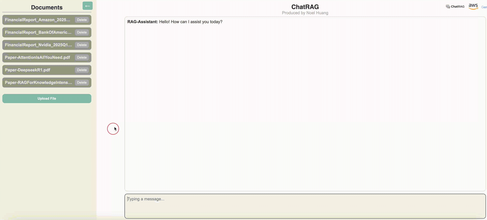
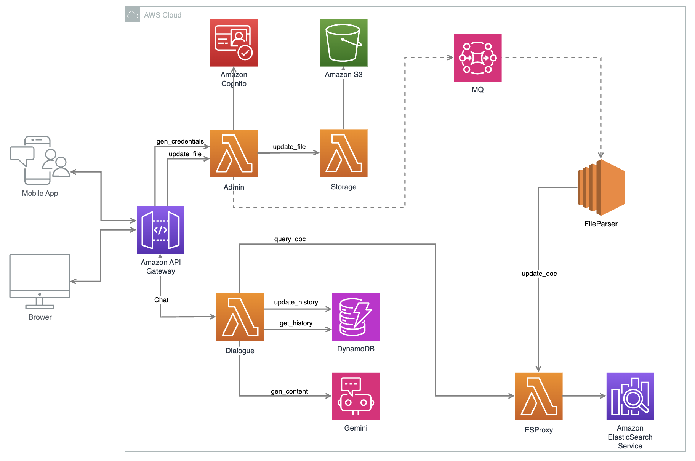
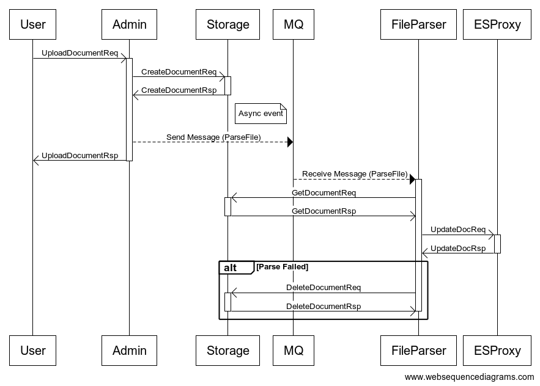
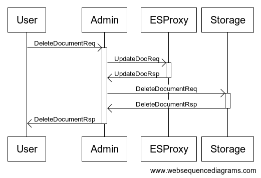
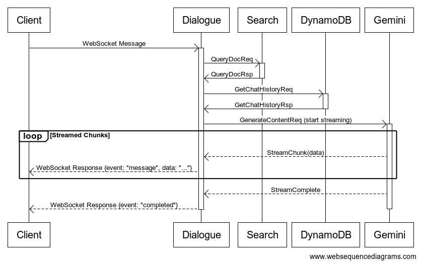

# ChatRAG

## HomePage

[ChatRAG](https://chatrag.github.io/Web/)

## Who am I

I'm ChatRAG, your intelligent knowledge assistant powered by **Retrieval-Augmented Generation (RAG)**. Unlike traditional chatbots that rely solely on pre-trained models, I combine the power of large language models with real-time access to curated documents—so I can give you accurate, up-to-date, and context-aware answers.

## Architecture

### System Design

The solution is fully serverless and deployed within the **AWS Cloud**, leveraging managed services for scalability, maintainability, and performance.

* **Scalable & Event-Driven**: Modular Lambda functions connected via queues and events.
* **Secure**: Fine-grained user access control via Cognito.
* **Search-Optimized**: Real-time document vector indexing using OpenSearch and embeddings.
* **Stateful Conversations**: DynamoDB ensures memory across sessions.
* **Separation of Concerns**: Upload, parse, search, and dialogue are isolated microservices.

### API Flow

#### File Upload

* Uploaded files are received via the **Admin Lambda** and stored in **Amazon S3**.
* Once stored, a message is pushed to **Amazon MQ**, which triggers the **Parser** service.
* The **Parser** is responsible for:
  * Splitting large documents into structured chunks.
  * Extracting metadata such as `title`, `offset`, and `content`.
  * Transforming raw documents into semantically searchable segments.

#### File Deletion

#### Chat

* End-users initiate interactions via a `Chat` endpoint exposed through **Amazon API Gateway**.
* The **Dialogue Lambda** serves as the core conversational engine, performing the following:
  * Retrieves chat history from **DynamoDB** (`get_history`).
  * Queries relevant document chunks from OpenSearch via `query_chunk`.
  * Calls the **Gemini** model (`gen_content`) to generate a context-aware response.
  * Updates conversation history in **DynamoDB** (`update_history`).

